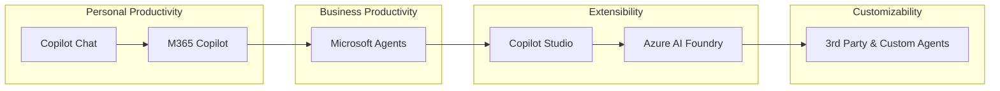
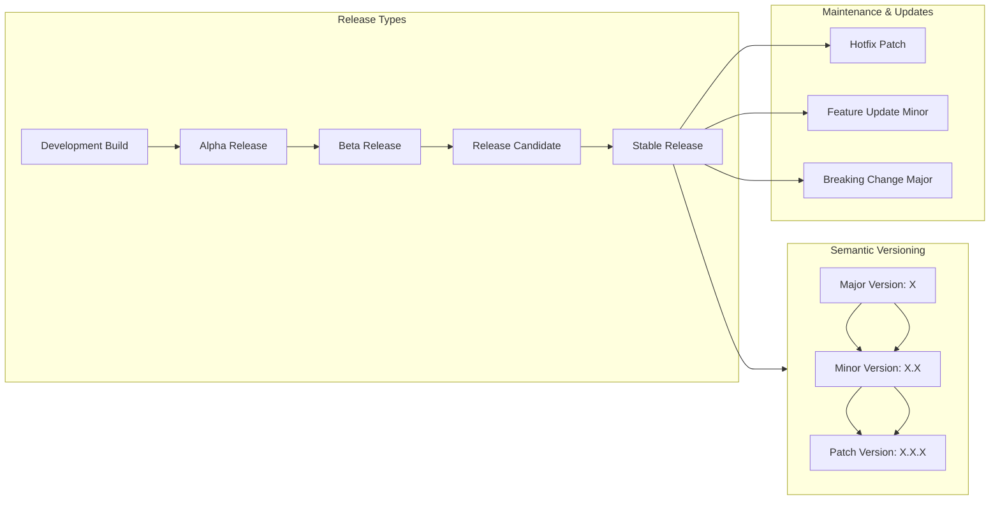

# Cloud2BR Open Source   Microsoft Cloud Sandbox - Learning Hub 

`Prototype in Sandbox → Build and experiment`

> This is where we can test ideas, create educational materials, and build PoC projects 

USA / Costa Rica

 [Cloud2BR OSS - Learning Hub](https://github.com/Cloud2BR-MSFTLearningHub)

Last updated: 2026-04-08

----------

> [!IMPORTANT]
> This is about different topics and areas within Microsoft Cloud Technologies. The Microsoft Cloud 
ecosystem includes a range of products and solutions designed to work together to provide comprehensive 
cloud services. It was created to have a hub with demos, technical talks, solutions, use cases, etc., 
about Microsoft Cloud and to share personal experience and learning with the community.
> The information provided and any document (such as scripts, sample codes, etc.) is provided `AS-IS` and `WITH ALL FAULTS`. Pricing estimates are for `demonstration purposes only and do not reflect final pricing`. `Microsoft assumes no liability` for your use of this information and makes no guarantees or warranties, expressed or implied, regarding its accuracy or completeness, including any pricing details. `Please note that these demos are intended as a guide and are based on personal experiences. For official guidance, support, or more detailed information, please refer to Microsoft's official documentation or contact Microsoft directly`: [Microsoft Sales and Support](https://support.microsoft.com/contactus?ContactUsExperienceEntryPointAssetId=S.HP.SMC-HOME)

<b> Endorsed for: </b> (Click to expand)

- [TechWorkshop L200: Migrate and Modernize your Estate](https://partner.microsoft.com/id-id/marketing-center/assets/collection/migrate-and-modernize-your-estate#/) - trainer
- [TechWorkshop L200: Azure AI Apps and Agents](https://microsoft.github.io/TWL200-Copilot-and-agents-at-work/) - trainer 
- [TechWorkshop L300: Azure AI Apps and Agents](https://microsoft.github.io/TechWorkshop-L300-AI-Apps-and-agents/) - trainer
- [TechWorkshop L300: GitHub Copilot and platform](https://github.com/microsoft/TechWorkshop-L300-GitHub-Copilot-and-platform) - trainer

<b> Certifications: </b> (Click to expand)

- [AI-900 - Study Guide: Azure AI Fundamentals](https://github.com/Cloud2BROpenSource/AI-900StudyGuide)
- [DP-900 - Study Guide: Azure Data Fundamentals](https://github.com/Cloud2BROpenSource/DP-900StudyGuide)
- [AI-102 - Study Guide: Azure AI Engineer Associate](https://github.com/Cloud2BROpenSource/AI-102StudyGuide)
- [DP-100 - Study Guide: Designing and Implementing a Data Science Solution on Azure](https://github.com/Cloud2BROpenSource/DP-100StudyGuide)

Copilot services and tools:

Deployment lifecycle of software:

<b> Details: </b> (Click to expand)

- **Semantic Versioning (vX.X.X)**  
  - **Major (X)**: Introduces breaking changes. Example: `v2.0.0` → incompatible with `v1.x.x`.  
  - **Minor (X.X)**: Adds new features but remains backward-compatible. E.g: `v1.3.0`.  
  - **Patch (X.X.X)**: Bug fixes or small improvements, no new features. E.g: `v1.3.2`.
- **Release Types**  
  - **Development Builds**: Internal, unstable, often nightly builds.  
  - **Alpha**: Early testing, incomplete features.
    - Internal testing phase.
    - Features are incomplete or unstable.
    - Used mainly by developers and sometimes a small internal QA team.
  - **Beta**: Feature-complete, external testers provide feedback.
    - Product is more stable and feature-complete.
    - Released to a limited group of external users (beta testers).
    - Goal: gather feedback, identify bugs, and test usability in real-world scenarios.
    - Often comes with disclaimers: “may contain bugs,” “not final,” etc.
  - **Release Candidate (RC)**: Candidate for final release, only critical fixes allowed.
    - A version that could be the final product if no major issues are found.
    - Focus is on fixing critical bugs only.
  - General Availability (GA): Official production-ready release. 
    - Official public release.
    - Considered stable, supported, and ready for production use.
- **Maintenance & Updates**  
  - **Hotfix (Patch)**: Urgent bug/security fix, increments patch number.  
  - **Feature Update (Minor)**: Adds new functionality without breaking compatibility.  
  - **Breaking Change (Major)**: Requires incrementing the major version due to incompatibility.  

<!-- START BADGE -->

  
  
Refresh Date: 2026-02-25

<!-- END BADGE -->
