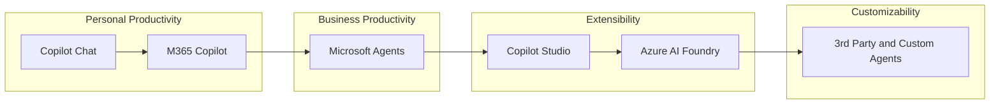
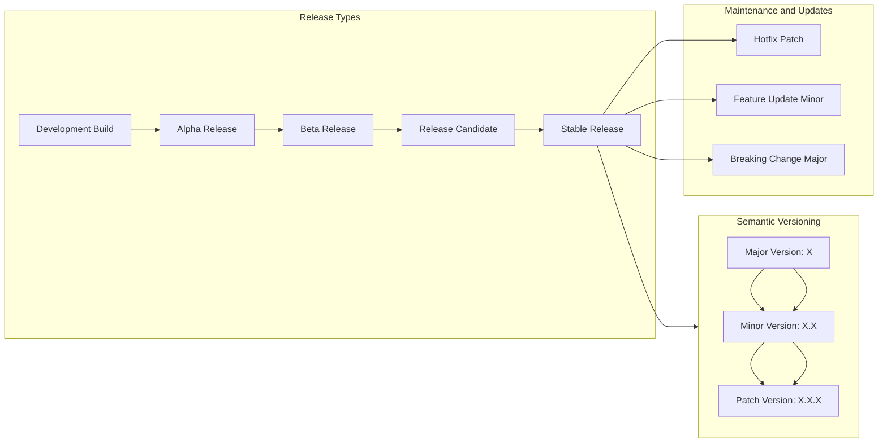

# Cloud2BR Microsoft Cloud Sandbox - Learning Hub

**Prototype in a sandbox. Build, experiment, and share practical Microsoft Cloud learning.**

----------

> **Mission:** Provide a safe place to test ideas, create educational materials, build proof-of-concepts, and share personal learning across Microsoft Cloud technologies.

## Learning resources

| Category | Description |
|---|---|
| **Demos and technical talks** | Practical examples, scenarios, and learning materials across Microsoft Cloud technologies |
| **Sandbox experiments and PoCs** | Safe projects for prototyping, testing ideas, and developing hands-on experience |
| **Study guides and certifications** | Structured resources for Microsoft certification preparation |
| **Solutions and use cases** | Reference implementations and examples that support applied learning |
| **Scripts and sample code** | Reusable technical assets for demonstrations and experimentation |

## Endorsements and certifications

<strong>Endorsed for Microsoft TechWorkshops</strong>

- <a href="https://partner.microsoft.com/id-id/marketing-center/assets/collection/migrate-and-modernize-your-estate#/" target="_blank" rel="noopener noreferrer">L200: Migrate and Modernize your Estate</a>
- <a href="https://microsoft.github.io/TWL200-Copilot-and-agents-at-work/" target="_blank" rel="noopener noreferrer">L200: Azure AI Apps and Agents</a>
- <a href="https://microsoft.github.io/TechWorkshop-L300-AI-Apps-and-agents/" target="_blank" rel="noopener noreferrer">L300: Azure AI Apps and Agents</a>
- <a href="https://github.com/microsoft/TechWorkshop-L300-GitHub-Copilot-and-platform" target="_blank" rel="noopener noreferrer">L300: GitHub Copilot and platform</a>

<strong>Microsoft certification study guides</strong>

- <a href="https://github.com/Cloud2BR-MSFTLearningHub/AI-900StudyGuide" target="_blank" rel="noopener noreferrer">AI-900: Azure AI Fundamentals</a>
- <a href="https://github.com/Cloud2BR-MSFTLearningHub/DP-900StudyGuide" target="_blank" rel="noopener noreferrer">DP-900: Azure Data Fundamentals</a>
- <a href="https://github.com/Cloud2BR-MSFTLearningHub/AI-102StudyGuide" target="_blank" rel="noopener noreferrer">AI-102: Azure AI Engineer Associate</a>
- <a href="https://github.com/Cloud2BR-MSFTLearningHub/DP-100StudyGuide" target="_blank" rel="noopener noreferrer">DP-100: Designing and Implementing a Data Science Solution on Azure</a>
- <a href="https://github.com/Cloud2BR-MSFTLearningHub/GH-900StudyGuide" target="_blank" rel="noopener noreferrer">GH-900: GitHub Foundations</a>

## Copilot services and tools

```mermaid
flowchart LR
  subgraph Personal_Productivity[Personal Productivity]
    CopilotChat[Copilot Chat] --> M365Copilot[M365 Copilot]
  end

  subgraph Business_Productivity[Business Productivity]
    MicrosoftAgents[Microsoft Agents]
  end

  subgraph Extensibility[Extensibility]
    CopilotStudio[Copilot Studio] --> AzureAIFoundry[Azure AI Foundry]
  end

  subgraph Customizability[Customizability]
    ThirdPartyCustomAgents[3rd Party and Custom Agents]
  end

  M365Copilot --> MicrosoftAgents
  MicrosoftAgents --> CopilotStudio
  AzureAIFoundry --> ThirdPartyCustomAgents
```

## Deployment lifecycle of software

```mermaid
flowchart LR
  subgraph Versioning[Semantic Versioning]
    Major[Major Version: X] --> Minor[Minor Version: X.X]
    Minor --> Patch[Patch Version: X.X.X]
  end

  subgraph Release_Types[Release Types]
    DevBuild[Development Build] --> Alpha[Alpha Release]
    Alpha --> Beta[Beta Release]
    Beta --> RC[Release Candidate]
    RC --> Stable[Stable Release]
  end

  subgraph Maintenance[Maintenance and Updates]
    Stable --> Hotfix[Hotfix Patch]
    Stable --> FeatureUpdate[Feature Update Minor]
    Stable --> BreakingChange[Breaking Change Major]
  end

  Major --> Minor
  Minor --> Patch
  Stable --> Versioning
```

<strong>Lifecycle details</strong>

- **Semantic Versioning (vX.X.X)**
  - **Major (X):** Introduces breaking changes. Example: `v2.0.0` is incompatible with `v1.x.x`.
  - **Minor (X.X):** Adds backward-compatible features. Example: `v1.3.0`.
  - **Patch (X.X.X):** Provides bug fixes or small improvements. Example: `v1.3.2`.
- **Release Types**
  - **Development Builds:** Internal and unstable builds, often produced nightly.
  - **Alpha:** Early testing with incomplete or unstable features, mainly for developers and a small internal QA group.
  - **Beta:** Feature-complete builds for limited external feedback, usability testing, and bug discovery.
  - **Release Candidate (RC):** A candidate for the final product; only critical fixes should be made.
  - **General Availability (GA):** Official public release that is stable, supported, and production-ready.
- **Maintenance and Updates**
  - **Hotfix (Patch):** Urgent bug or security fix that increments the patch version.
  - **Feature Update (Minor):** Adds functionality without breaking compatibility.
  - **Breaking Change (Major):** Requires a major version increment.

## Related organizations

| Organization | Purpose |
|---|---|
| <a href="https://github.com/Cloud2BR" target="_blank" rel="noopener noreferrer"><strong>Cloud2BR</strong></a> | Consulting and enablement hub |
| <a href="https://github.com/Cloud2BR-TEC" target="_blank" rel="noopener noreferrer"><strong>Cloud2BR TEC Hub</strong></a> | Technology Education Center |
| <a href="https://github.com/Cloud2BR-MSFTLearningHub" target="_blank" rel="noopener noreferrer"><strong>Cloud2BR MSFT Learning Hub</strong></a> | Microsoft Cloud Sandbox and open learning resources |

## Get involved

- **Explore** the organization repositories for demos, study guides, tools, and reference material.
- **Experiment** with the sandbox projects and adapt them to approved learning environments.
- **Contribute** through issues, pull requests, technical talks, and knowledge sharing.

> [!IMPORTANT]
> Materials, including scripts and sample code, are provided **AS-IS** and **WITH ALL FAULTS**. Pricing estimates are for demonstration purposes only and do not reflect final pricing. Microsoft assumes no liability for use of this information. For official guidance, support, or detailed information, refer to Microsoft's documentation or contact <a href="https://support.microsoft.com/contactus?ContactUsExperienceEntryPointAssetId=S.HP.SMC-HOME" target="_blank" rel="noopener noreferrer">Microsoft Sales and Support</a>.

> [!NOTE]
> Content is intended for learning, demonstrations, and practical experimentation. Review and validate materials before production use.

<!-- START BADGE -->

  
  
Refresh Date: 2026-09-02

<!-- END BADGE -->